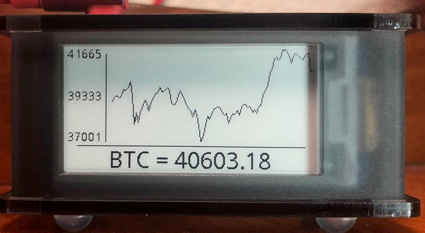

# Zero BTC Screen
Bitcoin stock price for your RPi Zero



## Hardware
* Raspberry Pi Zero W (or any other RPi)
* Waveshare eInk display (supports multiple versions)

## Installation
1. Turn on SPI via `sudo raspi-config`
    ```
    Interfacing Options -> SPI
   ```
2. Install eInk display drivers and dependencies
    ```
    sudo apt update
    sudo apt-get install python3-pip python3-pil python3-numpy
    pip3 install RPi.GPIO spidev
    git clone https://github.com/waveshare/e-Paper.git ~/e-Paper
    pip3 install ~/e-Paper/RaspberryPi_JetsonNano/python/
    ```
    for more information refer to: https://www.waveshare.com/wiki/2.13inch_e-Paper_HAT
3. Download Zero BTC Screen
    ```
    git clone https://github.com/dr-mod/zero-btc-screen.git ~/zero-btc-screen
    ```
4. Run it 
    ```
    python3 ~/zero-btc-screen/main.py
    ```
5. To make it run on startup
    1. `sudo nano /etc/rc.local` 
    2. Add one the following before `exit 0`
    ```
    /usr/bin/python3 /home/pi/zero-btc-screen/main.py&
    ```
    conversely, you can run in `screen`
    ```
    su - pi -c "/usr/bin/screen -dm sh -c '/usr/bin/python3 /home/pi/zero-btc-screen/main.py'"
    ```

## Screen configuration

The application supports multiple types of e-ink screens, and an additional "picture" screen.

To configure which display(s) to use, configuration.cfg should be modified.
In the following example an e-ink epd2in13v2 and "picture" screens are select:
```cfg
[base]
console_logs             : false
#logs_file                : /tmp/zero-btc-screen.log
dummy_data               : false
refresh_interval_minutes : 15

# Enabled screens or devices
screens : [
    epd2in13v2
#    epd2in13bv3
    picture
  ]

# Configuration per screen
# This doesn't make any effect if screens are not enabled above
[epd2in13v2]
mode : line

[epd2in13bv3]
mode  : line

[picture]
filename : /home/pi/output.png
```
The following screens are supported:
* epd2in13v2
* epd2in13bv3
* picture